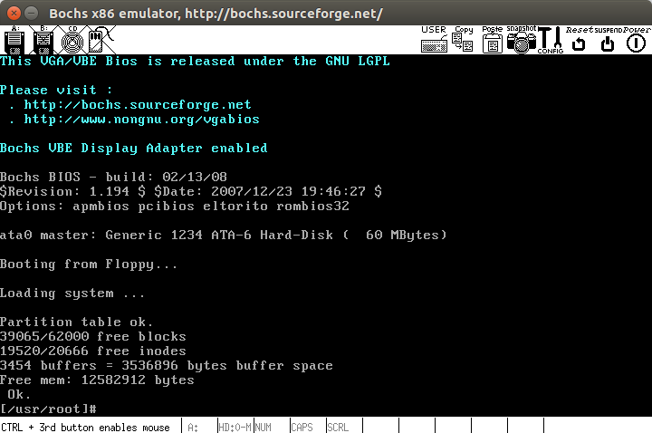

# 实验1 熟悉实验环境


## 平台和工具介绍

本操作系统实验的硬件环境是 IA-32（x86） 架构的 PC 机，主要软件环境是 Bochs + gcc + 你最喜欢的编辑器 / IDE + 你最喜欢的操作系统 + Linux 0.11 源代码。

实验的基本流程是根据实验要求编写应用程序、修改 Linux 0.11 的源代码，用 gcc 编译后，在 Bochs 的虚拟环境中运行、调试目标代码。

上述实验环境涉及到的软件都是免费且开源的，具有较强的可移植性，可以在多种计算机的多种操作系统上搭建。为方便实验者，我们在最常见的平台 Ubuntu（最流行的 GNU/Linux 发行版之一）——上制作了 hit-oslab 集成环境，它基本包含了实验所需的所有软件，安装过程非常简单，基本上是直接解压就可以使用。


### x86 模拟器 Bochs

Bochs 是一个免费且开放源代码的 IA-32（x86）架构 PC 机模拟器。在它模拟出的环境中可以运行 Linux、DOS 和各种版本的 Windows 等多种操作系统。而 Bochs 本身具有很高的移植性，可以运行在多种软硬件平台之上，这也是我们选择它做为本书的指定模拟器的主要原因。

如果您想拥抱自由的 Linux，那么 Bochs 几乎是您的不二选择。如果您想继续把自己绑定在 Windows 平台上，那么除了 Bochs，您还可以选用 VMware 或者 Microsoft Virtual PC。它们是最著名虚拟机软件，而且都可以免费使用。因为 Bochs 的是模拟器，其原理决定了它的运行效率会低于虚拟机。

但对于本书所设计的实验来说，效率上的差别很不明显。而且，Bochs 有虚拟机无可比拟的调试操作系统的能力，所以我们更建议您选用 Bochs。hit-oslab 已经内置了 bochs，本实验后文假定的缺省环境也是 Bochs。

关于 Bochs 的更详细的介绍请访问它的 [主页](http://bochs.sourceforge.net/) 及 Bochs 使用手册。


### GCC 编译器

GCC 是和 Linux 一起成长起来的编译器。Linux 最初的版本就是由 GCC 编译的。现在 GCC 也是在自由软件领域应用最广泛的编译器。所以，我们也选择 GCC 做为本书实验的指定编译器。


### GDB 调试器

GDB 调试器是 GCC 编译器的兄弟。做为自由软件领域几乎是唯一的调试器，它秉承了 Unix 类操作系统的一贯风格，采用纯命令行操作，有点儿类似 dos 下的 debug。

关于它的使用方法请看 GDB 使用手册。

另外，可以学习实验楼的 [《GDB 简明教程》](https://www.shiyanlou.com/courses/496)，通过动手实验学习 Linux 上 GDB 调试 C 语言程序的基本技巧。


### Ubuntu (GNU/Linux)

Ubuntu 也许不是目前最好用的 Linux 桌面发行版，但它一定是最流行的。主要特点是易用，非常的易用。现在，已经有越来越多的人开始用 Ubuntu 完全代替 Windows，享受更加自由、安全、守法的感觉。

Ubuntu 的主页是 http://www.ubuntu.com/ ，这里不仅可以免费下载到 iso 文件，甚至能免费申领 Ubuntu 的安装光盘。

我们强烈建议您在 Ubuntu 下做实验。因为有些实验内容涉及到在自己改进的 Linux 0.11 下，运行自己编的应用程序。被改进的功能都是高版本 Linux 内核已经具有的，在其上确认自己编写的应用程序无误后，再用之测试自己改进的 Linux 0.11，可以更有信心些。


## 实验环境的工作模式

### 准备环境

hit-oslab 实验环境简称 oslab，是一个压缩文件（hit-oslab-linux-20110823.tar.gz），这个文件已经下载到了 **/home/teacher** 目录和 **/home/shiyanlou/oslab**（大家一进入实验环境，就是点击左边的 terminal 打开终端以后，所在的目录就是 /home/shiyanlou，这是大家的主目录）下，大家可以使用下面的命令解压展开压缩包即可工作。

推荐大家使用如下的命令解压到 `/home/shiyanlou/oslab/` 中。

```shell
# 进入到 oslab 所在的文件夹
$ cd /home/shiyanlou/oslab/

# 解压，并指定解压到 /home/shiyanlou/
# 这样的话，在 /home/shiyanlou/oslab/ 中就能找到解压后的所有文件
$ tar -zxvf hit-oslab-linux-20110823.tar.gz -C /home/shiyanlou/

# 查看是否解压成功
$ ls -al
# 除了压缩包 hit-oslab-linux-20110823.tar.gz 之外，其他的就是压缩包中的内容
```


### 文件结构

**Image 文件**

oslab 工作在一个宿主操作系统之上，我们使用的 Linux，在宿主操作系统之上完成对 Linux 0.11 的开发、修改和编译之后，在 linux-0.11 目录下会生产一个名为 **Image** 的文件，它就是编译之后的目标文件。

该文件内已经包含引导和所有内核的二进制代码。如果拿来一张软盘，从它的 0 扇区开始，逐字节写入 Image 文件的内容，就可以用这张软盘启动一台真正的计算机，并进入 Linux 0.11 内核。

> oslab 采用 bochs 模拟器加载这个 Image 文件，模拟执行 Linux 0.11，这样省却了重新启动计算机的麻烦。

**bochs 目录**

bochs 目录下是与 bochs 相关的执行文件、数据文件和配置文件。

**run 脚本**

run 是运行 bochs 的脚本命令。

运行后 bochs 会自动在它的虚拟软驱 A 和虚拟硬盘上各挂载一个镜像文件，软驱上挂载是 linux-0.11/Image，硬盘上挂载的是 hdc-0.11.img。

因为 bochs 配置文件中的设置是从软驱 A 启动，所以 Linux 0.11 会被自动加载。

而 Linux 0.11 会驱动硬盘，并 mount 硬盘上的文件系统，也就是将 hdc-0.11.img 内镜像的文件系统挂载到 0.11 系统内的根目录 —— `/`。在 0.11 下访问文件系统，访问的就是 hdc-0.11.img 文件内虚拟的文件系统。

**hdc-0.11.img 文件**

hdc-0.11.img 文件的格式是 Minix 文件系统的镜像。

Linux 所有版本都支持这种格式的文件系统，所以可以直接在宿主 Linux 上通过 mount 命令访问此文件内的文件，达到宿主系统和 bochs 内运行的 Linux 0.11 之间交换文件的效果。

Windows 下目前没有（或者是还没发现）直接访问 Minix 文件系统的办法，所以要借助于 fdb.img，这是一个 1.44M 软盘的镜像文件，内部是 FAT12 文件系统。将它挂载到 bochs 的软驱 B，就可以在 0.11 中访问它。而通过 filedisk 或者 WinImage，可以在 Windows 下访问它内部的文件。

**hdc-0.11.img 内包含有：**

- Bash shell；
- 一些基本的 Linux 命令、工具，比如 cp、rm、mv、tar；
- vi 编辑器；
- gcc 1.4 编译器，可用来编译标准 C 程序；
- as86 和 ld86；
- Linux 0.11 的源代码，可在 0.11 下编译，然后覆盖现有的二进制内核。

> 其他文件在后面用到的时候会进行单独讲解。


## Ubuntu 环境搭建

1. 解压缩 hit-oslab-linux-20110823.tar.gz 

   ```shell
   tar zxvf hit-oslab-linux-20110823.tar.gz
   ```

2. 安装 gcc-3.4

   ```shell
   tar zxvf gcc-3.4-ubuntu.tar.gz		
   cd gcc-4.3
   sudo ./inst.sh amd64
   ```

3. 安装 as86 和 ld86 工具（用于编译和链接 linux-0.11/boot/ 目录下的 bootsect.s 和 setup.s）

   ```shell
   sudo apt install bin86
   ```

   提示：搜索 as86 和 ld86 包

   ```shell
   $ apt-cache search as86 ld86
   bin86 - 16-bit x86 assembler and loader
   ```

4. 安装 32 位 libc 开发包

   ```shell
   sudo apt install linux-libc-dev:i386
   ```

5. 安装 C 编译环境

   ```shell
   sudo apt install build-essential
   ```

6. 编译内核

   ```shell
   cd oslab/linux-0.11
   make
   ```

   编译完成后在 linux-0.11 目录下会生产一个名为 Image 的文件。

7. 运行 linux-0.11

   ```shell
   cd oslab
   ./run
   ```

   由于缺少几个库 libSM.so.6、libX11.so.6、libXpm.so.4，因此需要安装 i386 版本的库

   ```shell
   sudo apt install libsm6:i386
   sudo apt install libx11-6:i386
   sudo apt install libxpm4:i386
   ```

   提示：检查库文件是否安装成功

   ```shell
   ldconfig -p | grep libSM.so.6
   dpkg-query -S libX11.so.6
   dpkg-query -S libXpm.so.4
   ```

   安装完成后再次运行 `./run` 即可。

   


